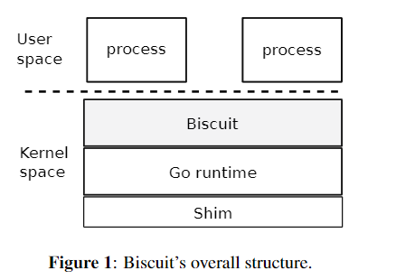

# [译][论文] 用高级语言编写POSIX内核的好处与成本

### 译者序

本文来自2018年Cody Cutler的论文：The benefits and costs of writing a POSIX kernel in a high-level language。主要介绍了采用HLL -> Go语言编写一个单片POSIX的论文带来的好处与花费的成本。

**译者水平有限，不免存在遗漏或错误之处。如有疑问，敬请查阅原文。**

以下是译文。

## 摘要

本文通过评估使用高级语言（HLL）和垃圾回收来实现一个单体式POSIX风格内核的可行性，探讨了使用HLL代替C语言编写内核的性能成本、实现挑战以及可编程性和安全性方面的优势和劣势。

## 1 引言

### 1.1 背景 c语言的优劣概括

内核的默认语言是C，优势在于灵活的内存访问和管理，但需要足够谨慎和充足经验才能安全使用，即使这样，低级错误也十分常见。有数据统计，2017年至少五十个内核漏洞设计C代码的内核缓冲区溢出。

高级语言（HLLs）例如Go、Rust之类，提供了内存安全在编译前和运行时检查，以及很多抽象的底层接口实现（如线程）。许多HLL提供垃圾收集，以减少程序员的工作量，并一定程度上避免内存错误。

### 1.2 探索：Go为x86-64硬件编写的新内核Biscuit

操作系统的设计者一直怀疑HLL的内存管理是否与高性能的生产内核兼容。虽然可能用HLL重写现有的内核可能没有意义，但何种语言适合新的内核项目值得考虑。由于内核的独特的约束以及要求，在内核的上下文中讨论这个问题是有意义的。

Go是一种带有垃圾回收的类型安全语言。Biscuit通过公开POSIX子集系统调用接口，在不修改源代码的情况下运行重要的现有应用程序，如NGINX和Redis。支持的功能包括：

- 多核、内核支持的用户线程
- futex、IPC、mmap
- 写时复制分叉
- vnode和名称缓存
- 日志文件系统和TCP/IP套接字

并且Biscuit实现了两个重要的设备驱动程序：

- 一个用于AHCI SATA磁盘控制器
- 另一个用于基于Intel 82599的以太网控制器

### 1.3 数据采集与基准测试

在Biscuit上运行了几个内核密集型应用程序，并测量Go的类型安全和垃圾收集对性能的影响。基准测试结果显示：GC的成本高达CPU的3%，GC相关的暂停时间为115$\mu s$，单个nignx客户端请求延迟最长时间总计为600$\mu s$，其他有数据支撑的HLL性能约为CPU的10%。

为了直接对比C与Go性能，我们修改了Biscuit和C内核，使其具有几乎相同的源代码级路径，分别用于两个有大量系统调用、页面错误和上下文切换的基准测试，结果显示：C版本比Go版本快5%和15%。

最后，我们在内核密集型应用程序基准测试上比较了Biscuit和Linux的性能，发现Linux比Biscuit快10%。

### 1.4 本文主要贡献

1. Biscuit：Go有能力编写一个性能尚可的内核
2. 给出了一种新的内核堆暴露的处理方案
3. 讨论了在内核中使用HLL是否有帮助的定性方法
4. 使用内核中典型的等效代码横评Go-vs-C的性能

## 2 动机

### 2.1 Why C?

C支持指针运算，轻松逃离类型强制，显卡内存分配和自定义定位器；可以操作硬件寄存器并且不依赖复杂的运行时，能保证较好的性能。

### 2.2 Why an HLL?

自动内存管理减少了工作量；类型安全检测错误，运行时方法调度有助于抽象；对线程和同步的语言支持简化的并发编程。

HLL中的一些类型错误比C种要小得多。但垃圾手机和安全检查会占用CPU，导致较高的延迟。

## 3 概览

### 3.1 启动和Go运行时

引导块加载Biscuit、Go运行时和一个shim层。如图：

shim层提供了很多底层功能：调用底层内核、内存分配和执行上下文。

### 3.2 进程和内核Go运行时

Biscuit为用户进程提供了POSIX接口：fork、exec等，包括内核支持的线程和futex。Biscuit用硬件页面保护隔离用户进程。Biscuit维护一个对应于每个用户线程的内核goroutine；该goroutine为线程的页面错误和异常执行系统调用和处理情绪。

### 3.3 中断

Biscuit设备只能高端处理程序将关联的设备驱动goroutine标记为可运行，然后返回，类似传统内核的做法。Go运行期间不会在敏感操作（如goroutine上下文切换）期间关闭中断。

### 3.4 多核和同步

Biscuit在多核硬件上运行。其使用Go mutex保护其数据结构，并使用Go的channel和条件变量进行同步。它锁定足够==不同内核上的线程的系统调用==以及==并行执行==所需要的足够细粒度。Biscuit 在某些性能关键型代码中使用无读锁查找。

### 3.5 虚拟内存

Biscuit使用页表实现零填充按需内存分配、写时复制和文件的延迟映射（例如：对于exec，仅在进程页面错误时填充PTE和mmap）。

Biscuit会记录连续的内存映射，在通常情况下，不需要大量映射对象，物理页可以有多个引用，Biscuit使用引用计数跟踪这些引用。

### 3.6 文件系统

Biscuit 使用==互斥锁==保护每个虚拟节点，并通过首先尝试在==无读锁目录缓存==中进行查找来解析路径名，然后再回退到锁定路径。Biscuit==将每个文件系统调用作为事务运行==，并具有一个日志，用于以原子方式将更新提交到磁盘。

### 3.7 网络堆栈

Biscuit 在 Go 中实现了 TCP/IP 堆栈和英特尔 PCI-Express 以太网 NIC 的驱动程序。驱动程序使用 DMA 和 MSI 中断。系统调用 API 提供 POSIX 套接字。

### 3.8 局限性

虽然Biscuit可以在不修改源代码的情况下运行许多Linux C程序，但它是一个研究原型，缺乏许多功能。Biscuit ==不支持调度优先级==，因为它依赖于 Go 运行时调度程序。Biscuit 针对少量内核进行了优化，但==不适用于大型多核计算机或 NUMA==。Biscuit 不会交换或分页到磁盘，也不会实现窃取映射页所需的反向映射。Biscuit ==缺少许多安全功能==，如用户、访问控制列表或地址空间随机化。

## 4 垃圾收集

Biscuit使用垃圾收集对其性能构成了明显的威胁。本节概述了 Go 收集器的设计，并描述了 Biscuit 如何配置收集器。

### 4.1 Go的收集器

Go有一个并发的并行标记和扫描垃圾收集器。并发方面对Biscuit至关重要。工作流程：

- Go 收集器处于空闲状态
- 从最后一个集合生成的空闲列表中进行分配
- 检测可用空间低于阈值
- 跟踪指针、查找和标记可访问的对象的工作与执行过程

跟踪完所有指针后，收集器将关闭写入block并恢复正常执行流程，最后检测是否已标记所有对象。最后从未标记的内存部分扫描重建可用列表。（但由于**不移动对象因此不会减少内存碎片**）

收集花费的CPU时间大致与活动对象的数量成正比，与收集之间的间隔成反比。通过将足够的RAM用于堆，可以增大间隔。

### 4.2 Biscuit 的堆内存大小

启动时，Biscuit为其堆内存分配固定数量的RAM，默认为总RAM的$\frac{1}{32}$。Go通常会在实时数据过半时扩展堆内存（超过1042byte似乎是1.25倍扩展）。==但Biscuit禁用此扩展==。

## 5 禁用堆内存扩展

Biscuit必须解决实时内核数据将堆内存“耗尽”的问题，这是现有（2018）内核难以解决的难题。

### 5.1 做法：保留（reservation）

当内存中存在可被识别的恶意进程时，它将采取纠正措施，如果某些进程使用了过多内核资源，Biscuit会试图识别并kill他们，

Biscuit的内核堆耗尽有三个要素：

- 首先，接近堆耗尽时==清除缓存和软状态==（soft state）
- 其次，系统调用开始前==等待，直到有足够的堆内存得以分配==
- 然后，内核杀手线程在==堆接近耗尽时==监视并杀死小号大量堆内存的进程

**好处：**大部分应用程序不必处理由于内核堆耗尽而导致的堆分配失败，并且不需要包含从系统调用中途从此类故障中恢复的逻辑。系统调用可以在入口点等待而不持有锁，从而避免了死锁。

“杀手线程”必须区分恶意进程和正常的进程。POSIX中缺少内核优雅的撤销资源的做法，导致在某些内存不足的情况下并没有很好的解决方案。

### 5.2 Biscuit如何保留 （reserve）

Biscuit将固定数量的RAM 专用于内核堆。仅当剩余内存足以分配系统调用去执行时，系统调用才会启动。

$s$为系统调用可以使用的最大数据量，系统调用可以从堆中分配超过$s$的数据量，但==超过$s$的必然失效==，并且可以由收集器释放。

> Figure 2 presents pseudo code for reserving and re- leasing the reservation of heap RAM in Biscuit. Before starting a system call, a thread checks that $L + s < M$. If $L + s < M$, the thread reserves by adding $s$ to n, oth- erwise the thread wakes up the killer thread and sleeps. When finished, a system call calculates a, the total amount actually allocated, and uses a to (partially) release any over-reservation: if $a <s$, the system call adds $a$ to $c$ and subtracts s from $n$. Otherwise, $a ≥ s$ and the system call adds $s$ to$ c$ and subtracts $s$ from $n$.

### 5.3 静态分析以查找$s$

#### 5.3.1 基本MAXLIVE操作

#### 5.3.2 处理循环

如果==没有足够的堆空间，循环将会被终止==，并在系统调用开始时等待可用内存，当内存可用时重试。

#### 5.3.3 内核线程

#### 5.3.4 杀手线程

## 6 实现

Biscuit 提供了58个系统调用，它具有足够的POSIX兼容性来运行一些现有的服务器程序。

Biscuit 包含 90 种 Go “不安全”例程的使用（不包括 Go 运行时中的使用）。这些不安全的访问解析和格式化数据包，在物理页码和指针之间进行转换，读取和写入用户内存以及访问硬件寄存器。

我们修改了 Go 运行时以记录每个 goroutine（用于堆预留）分配的字节数，检查可运行的设备处理程序 goroutine，并将默认堆栈大小从 2kB 增加到 8kB，以==避免一些常见系统调用的堆栈扩展==。

Goroutine调度决策和上下文切换实现存在于运行时中，而不是在Biscuit中。一个后果是Biscuit不控制调度策略;它继承运行时的策略。另一个后果是，切换 goroutines 时不会切换每个进程的页表，因此 Biscuit 系统调用代码无法安全地直接取消引用用户地址。相反，Biscuit 显式将用户虚拟地址转换为物理地址，并显式检查页面权限。

## 7 评价

- Biscuit使用了高级语言的特性
- ==降低代码出bug的可能==

## 8 总结

本来想结合代码花一周时间学习一下这个Go语言写的操作系统，并翻译这篇论文中感兴趣的部分，奈何在对操作系统整体架构没有熟悉到一定地步，看源码还是略显困难，期待未来能把这个坑填好，也希望大佬指正。
